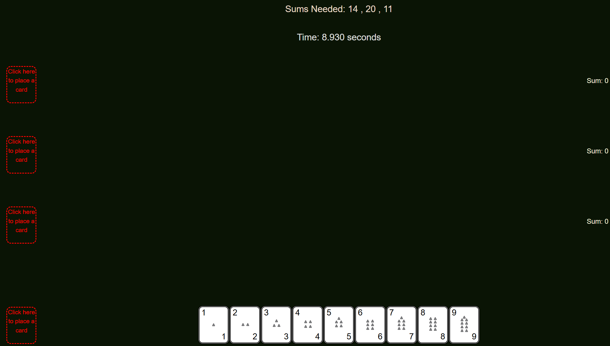

# Add Up The Cards

A full-stack mathematical puzzle game built with SvelteKit, Node.js, and Supabase where players strategically place cards into stacks to match target sums.

## Technology Stack

- **Frontend**: SvelteKit
- **Backend**: Node.js
- **Database**: PostgreSQL via Supabase
- **Authentication**: Supabase OAuth (Google)
- **Hosting**: Vercel

## Development

This project uses SvelteKit for the frontend with Supabase providing backend services including authentication and database storage. The game logic is implemented entirely in Svelte components with reactive state management.

## Game Overview

Add Up The Cards is a brain-teasing card game that challenges players to arrange numbered cards into stacks that match specific target sums. 

## Features

- **Responsive Design**: Playable on both desktop and mobile devices.
- **User Accounts**: Sign in with your Google Account to track your scores and progress.
- **Leaderboards**: View your personal best times and view the profiles of other players.

## Play Now

The game is hosted on Vercel and can be played at https://add-up-the-cards.vercel.app/

